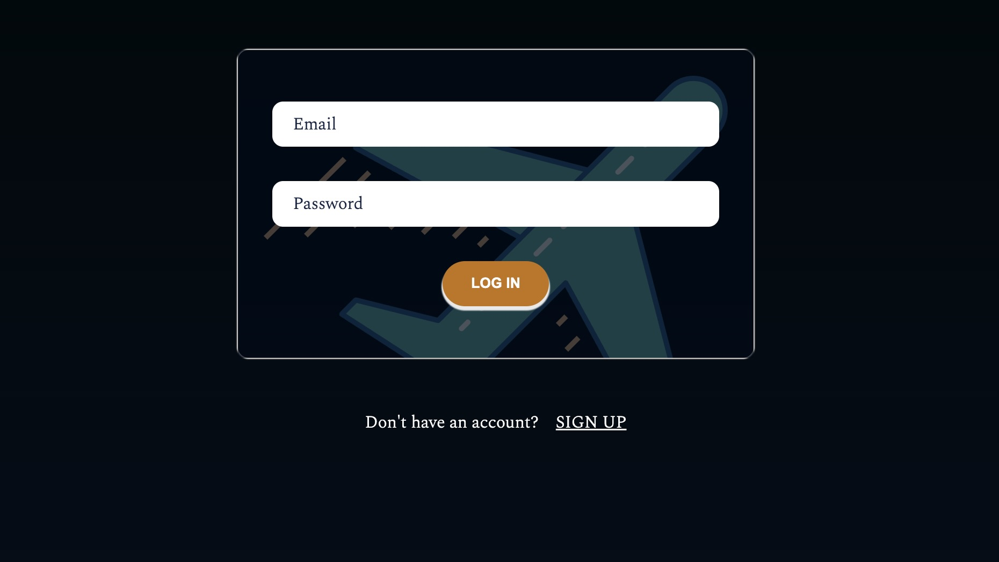
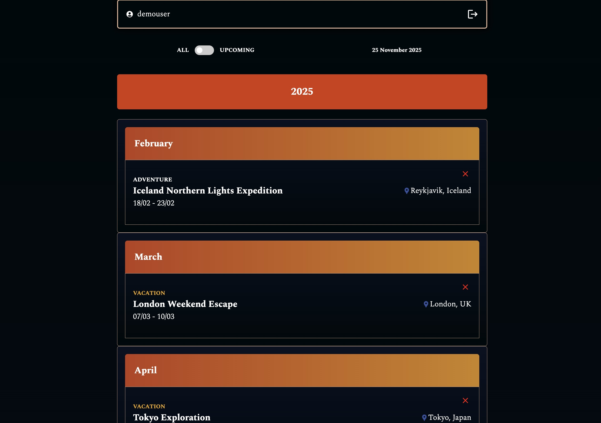
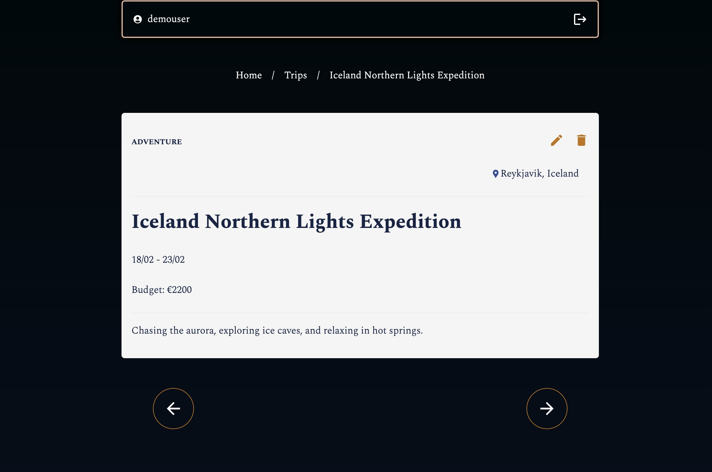

Demo account: 
username: demouser@example.com  
password: Abc1234
 
The demo account includes a few sample trips for demonstration. 
 

# Tripkeep
A full-stack web application that helps users keep track of their trips.
-----
## Tech Stack
- **Next.js**
- **TypeScript**
- **SCSS**
- **NextAuth**
- **SQL Database**

-----
## Features
-**User authentication:** Sign up, login, session management with NextAuth  
-**Trip Management (CRUD):**
- Add new trips
- Edit existing trips
- Delete trips  
- **Filter**: Toggle between **all trips** or **upcoming trips**  
- **Responsive Design**  
- **Persistent Data:** Trips are stored in an SQL Database  

Work in progress.

Created by Peter Miron [https://github.com/zgfpeter]

## License
## License
This project is licensed under the [CC BY-NC 4.0 License](https://creativecommons.org/licenses/by-nc/4.0/).  
zgfpeter.  
